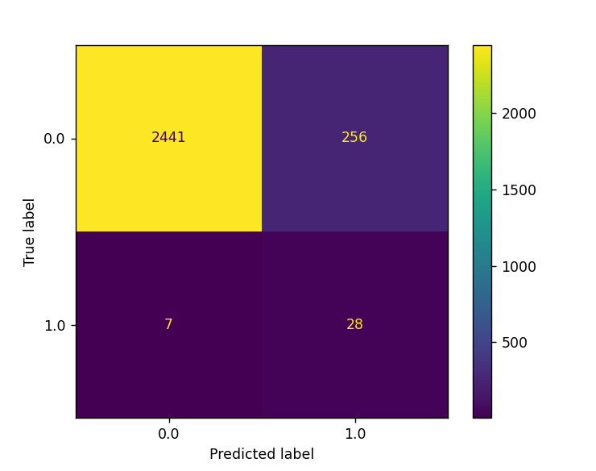
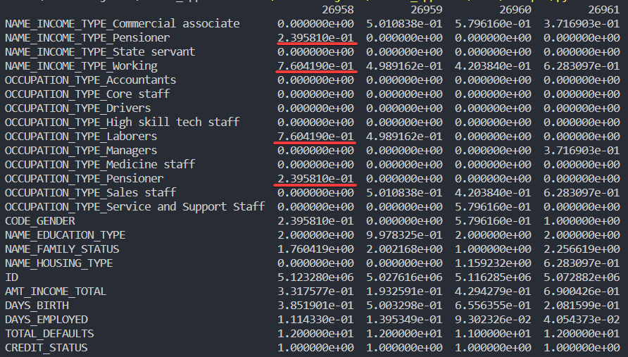
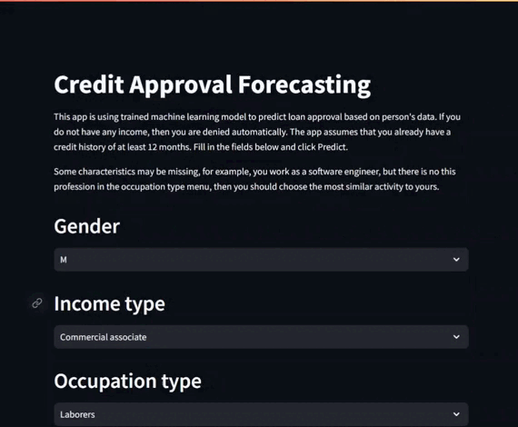

# LOAN APPROVAL FORECASTING

</img>

<p align='center'>
  
  
  <a href="https://loanapprovalforecasting-by-dysff-f4vtebkbckrwqsaenn6iyr.streamlit.app">
  
  </a>
  <a href="https://www.kaggle.com/datasets/rikdifos/credit-card-approval-prediction/data">
  
  </a>
</p>

## Overview

The application uses a trained machine learning model to predict the issuance of a loan to a person. The model is deployed using Streamlit. The app should help people determine whether they will be eligible for a loan or not.

## Technologies used

<p align='center'>
  
  
  
  
  
</p>

## Features

### Metrics
<b>METRIC: RECALL</b> 
<p>
It is required to identify all unreliable clients. If the prediction is not clear, then it is worth rejecting this client in order to avoid subsequent problems with him. It is for this reason that the best metric for this would be recall.
</p>

Confusion matrix of GradientBoostingClassifier


### Methods
<p>
    <ul>
      <li>Object-Oriented Programming (OOP)</li>
      <li>Weight of Evidence(WOE), Information Value(IV)</li>
      <li>IQR</li>
      <li>Data Analysis</li>
      <li>Data Visualization</li>
      <li>Data Cleaning</li>
      <li>Feature Engineering</li>
      <li>Fine-tuning hyperparameters</li>
      <li>User Interface Design</li>
      <li>Model Deployment using Streamlit</li>
      <li>Integration of User Inputs</li>
      <li>Data Upload Mechanism</li>
      <li>New Data Handling in the Web App</li>
    </ul>
</p>

### Problems encountered in the process
<b>SMOTE</b> 
<p>
As you know, SMOTE is not recommended to be applied to categorical data. It uses KNN to create new samples to solve the problem of data imbalance. Since 90% of dataset is categorical data, using this method will lead to anomalies in the new samples created by SMOTE. Basically, getting numbers other than 1 or 0 in binary columns, getting numeric values in several columns of one hot encoded column at once. All this leads to the fact that a mixture of abnormal and normal data gets into the training data, on which the model is then trained. The model may have good performance when evaluated on training data, but in fact, when predicting on new data(data entered by the user), the model's performance will be many times worse.



</p>
<p>
To deal with this problem, I used the compute_sample_weight method from the scikit-learn library. With SMOTE method, 0 class: 0.90, 1 class: 0.91, and after weights sampling, 0 class: 0.91, 1 class: 0.80.
</p>

## Example and Usage
You can check how this app works by yourself, just click on **OPEN ON STREAMLIT** badge.

This app is using trained machine learning model to predict loan approval based on person's data. If you do not have any income, then you are denied automatically. The app assumes that you already have a credit history of at least 12 months. Fill in the fields below and click Predict.

Some characteristics may be missing, for example, you work as a software engineer, but there is no this profession in the occupation type menu, then you should choose the most similar activity to yours.



## Getting started
This step involves cloning the repository from the provided GitHub URL. After cloning, change your working directory to the newly cloned repository with cd loan_approval_forecasting:
```shell
git clone https://github.com/dysff/loan_approval_forecasting.git
cd loan_approval_forecasting
```
Create a virtual environment(optional but recommended):
```shell
python -m venv venv
```
Activate the virtual environment:
```shell
Windows:
venv\Scripts\activate

Unix/MacOS:
source venv/bin/activate
```
Requirements installation:
```shell
pip install -r requirements.txt
```

## License <a href="LICENSE">  </a>

This project is licensed under the MIT License - see the
[LICENSE.md](LICENSE) file for
details.